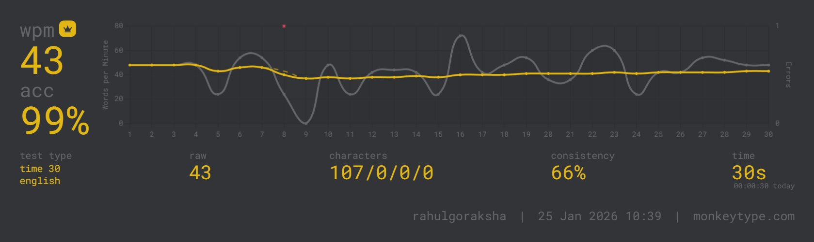

## Day 03 – Accuracy & Control Improvement

Date: 27 Jan 2026  
Tool: Monkeytype  
Test Type: English (30s)

### Results
- WPM: 41
- Accuracy: 98%
- Consistency: 70%
- Raw WPM: 42

### Analysis
- Speed remained stable compared to Day 02
- Accuracy stayed very high, indicating strong finger control
- Raw speed spikes show potential for higher WPM
- Consistency dropped slightly due to uneven pacing and sudden slowdowns
- Speed dips occurred after fast bursts, impacting rhythm

### Next Focus
- Improve consistency by maintaining uniform typing pace
- Reduce sudden speed bursts
- Practice longer timed tests (60s) for rhythm stability

## Day 02 – Accuracy & Control Improvement

Date: 26 Jan 2026  
Tool: Monkeytype  
Test Type: English (30s)

### Results
- WPM: 43
- Accuracy: 98%
- Consistency: 58%
- Raw WPM: 46

### Analysis
- Speed remained stable compared to Day 01
- Accuracy stayed very high, indicating strong finger control
- Raw speed spikes show potential for higher WPM
- Consistency dropped slightly due to uneven pacing and sudden slowdowns
- Speed dips occurred after fast bursts, impacting rhythm

### Next Focus
- Improve consistency by maintaining uniform typing pace
- Reduce sudden speed bursts
- Practice longer timed tests (60s) for rhythm stability

